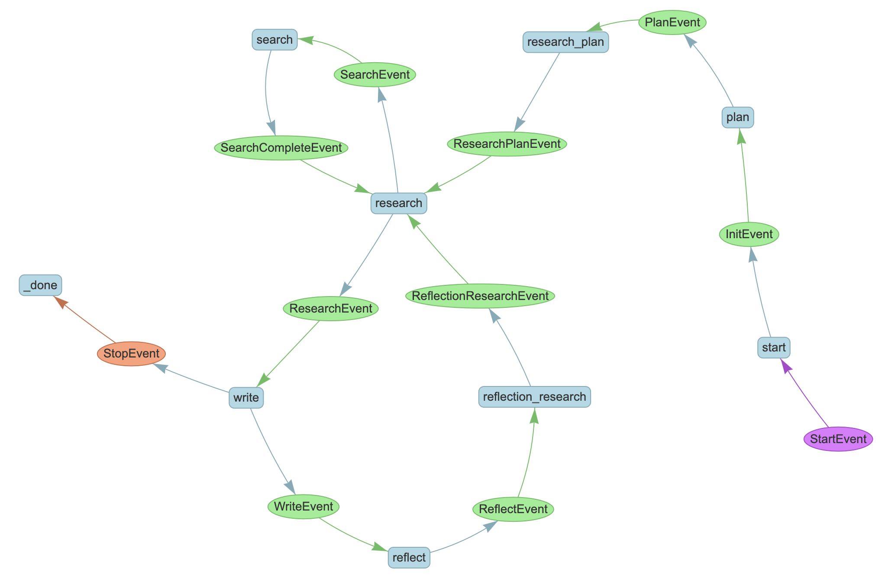

# Narcissus

## About

Narcissus is a self-reflective essay writing system that uses AI to create, research, and iteratively improve essays through a process of writing and self-reflection. The system:

1. Plans the essay structure based on the given topic
2. Conducts automated research using the Tavily search API
3. Writes initial drafts using GPT-4
4. Reflects on its own writing
5. Uses those reflections to conduct additional research and improve the essay
6. Repeats this process until the desired number of drafts is reached

The system demonstrates how AI can engage in self-reflective writing, continuously improving its output through a cycle of writing, analysis, and refinement.

## Workflow

### Visual Overview



### Detailed Description

The workflow consists of several key steps:

1. **Initialization** (`start`):
   - Sets up the workflow state
   - Initializes counters for drafts and searches
   - Stores the query topic

2. **Planning** (`plan`):
   - Takes the topic and generates a structured outline
   - Uses GPT-4 to break down the topic into key points
   - Creates a coherent plan for the essay

3. **Research Planning** (`research_plan`):
   - Analyzes the outline to identify research needs
   - Generates specific search queries for each topic
   - Structures queries for optimal search results

4. **Research** (`research` and `search`):
   - Executes parallel searches using Tavily API
   - Collects and aggregates search results
   - Stores research data for writing

5. **Writing** (`write`):
   - Combines outline, research, and any previous drafts
   - Generates essay content using GPT-4
   - Tracks draft versions and progress

6. **Reflection** (`reflect`):
   - Analyzes the written essay
   - Identifies areas for improvement
   - Generates critique and suggestions

7. **Reflection Research** (`reflection_research`):
   - Plans additional research based on reflection
   - Identifies gaps in current research
   - Feeds back into the research cycle

The workflow uses state management to track progress and ensure coherent development of the essay across multiple drafts. Each step builds on previous steps, creating a recursive improvement cycle.

## Usage

### Quick Start with Make

```bash
# Build the Docker image
make build

# Run interactive shell
make run-interactive

# Run writer workflow directly
make run-writer
```

### Docker Setup (Manual)

Build the container:
```bash
docker build -t narcissus .
```

#### Running the Container

There are two ways to run the container:

1. Interactive shell (good for development):
```bash
docker run -it --env-file .env -v "${PWD}/src:/app/src" narcissus
```

Inside the interactive shell, you can run any Python script:
```bash
# Inside the container
python -m narcissus.workflows.writer  # Run the writer workflow
```

2. Run a specific file directly (good for production/automation):
```bash
# Run the script directly or as a module
docker run --env-file .env -v "${PWD}/src:/app/src" narcissus python src/narcissus/workflows/writer.py
```

### Environment Setup

Make sure your `.env` file contains the necessary API keys:
- `TAVILY_API_KEY`: For web search functionality
- `OPENAI_API_KEY`: For GPT-4 access